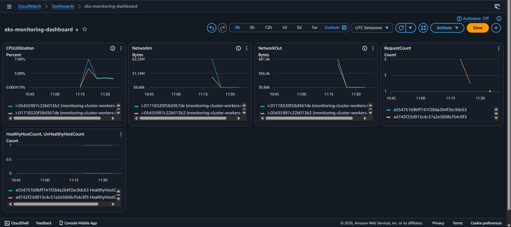
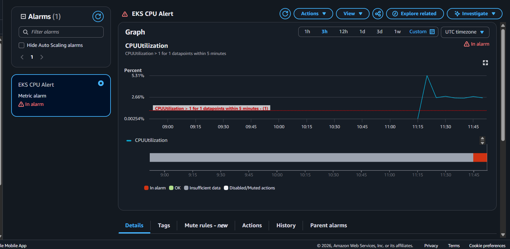
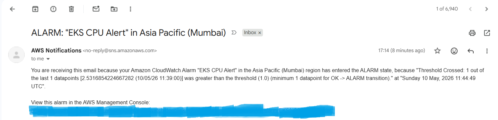
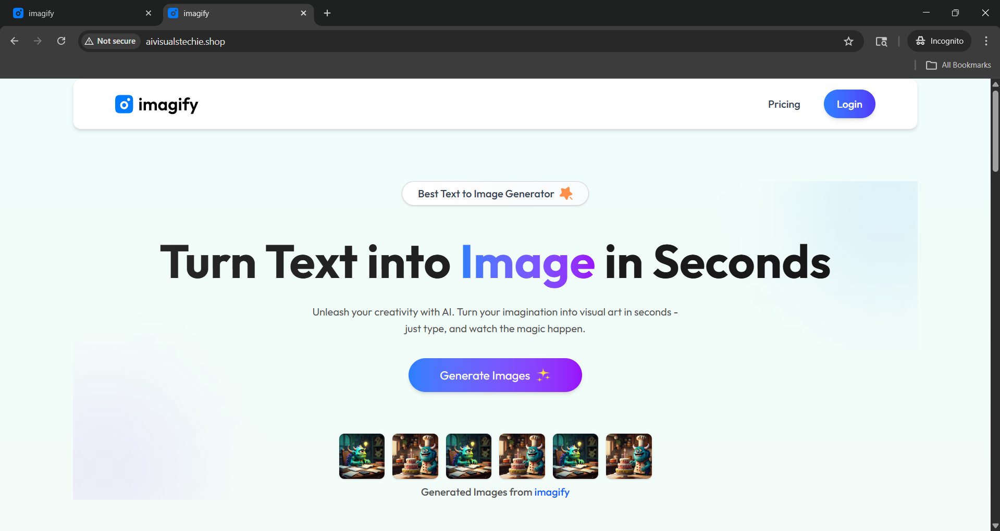

# 🚀 High-Availability Container Orchestration & Observability on AWS EKS


---

## 📌 Overview

Production-style deployment of a containerized frontend application on **Amazon EKS** using Kubernetes, integrated with **Route 53** for custom domain routing, and **CloudWatch + SNS** for real-time monitoring and alerting.

> ⚠️ AWS resources are torn down to avoid costs. All configurations, YAMLs, and screenshots are preserved in this repo.

---

## 🏗️ Architecture

```
User Request
     ↓
Route 53 (Custom GoDaddy Domain)
     ↓
AWS LoadBalancer Service
     ↓
Amazon EKS Cluster
     ↓
Kubernetes Pods (Frontend App)
     ↓
CloudWatch + SNS Alerts
```

---

## ⚙️ Tech Stack

| Category | Tools |
|---|---|
| Container Orchestration | Amazon EKS, Kubernetes |
| Cloud Infrastructure | AWS EC2, IAM, VPC |
| DNS & Routing | Route 53, GoDaddy Domain |
| Monitoring | Amazon CloudWatch |
| Alerting | Amazon SNS, Email Notifications |
| Containerization | Docker |

---

## 🎯 What Was Implemented

- ✅ Deployed containerized app on **Amazon EKS** using Kubernetes Deployments with 2 replicas
- ✅ Exposed app publicly using **Kubernetes LoadBalancer Service**
- ✅ Integrated **Route 53** with custom GoDaddy domain to route traffic to LoadBalancer
- ✅ Built **CloudWatch dashboards** monitoring CPU, network traffic, and request counts
- ✅ Configured **SNS email alerts** for infrastructure threshold breaches

---

## 📸 Project Screenshots

### 🖥️ EKS Cluster Status


### 🪣 Pods Running


### ⚙️ Kubernetes Service (LoadBalancer)


### 🌐 Route 53 DNS Record


### 📊 CloudWatch Dashboard


### 🔔 SNS Alarm Configuration


### 📧 SNS Email Alert


### 📤 Project Output


---

## 📂 Repository Structure

```
eks-k8s-deployment/
├── deployment.yaml       # Kubernetes Deployment manifest
├── service.yaml          # Kubernetes LoadBalancer Service
├── screenshots/          # Project output screenshots
└── README.md
```

---

## 🧠 Challenges Faced & Solved

| Challenge | Solution |
|---|---|
| LoadBalancer DNS propagation delay | Waited for Route 53 TTL + verified with nslookup |
| CloudWatch metrics not appearing | Enabled Container Insights on EKS cluster |
| SNS email not received | Confirmed subscription from email inbox |

---

## 🔁 How to Reproduce

```bash
# 1. Create EKS Cluster
eksctl create cluster --name my-cluster --region ap-south-1

# 2. Apply Kubernetes manifests
kubectl apply -f deployment.yaml
kubectl apply -f service.yaml

# 3. Verify pods and service
kubectl get pods
kubectl get svc

# 4. Configure Route 53 with LoadBalancer DNS
# 5. Enable CloudWatch Container Insights from AWS Console
```

---

## 👨‍💻 Author

**Sujal Shaha** | [LinkedIn Profile](https://www.linkedin.com/in/sujal-shaha-15832b286/) | [GitHub](https://github.com/sujal-07-Ronny)

🏅 AWS Certified Cloud Practitioner (CLF-C02)
